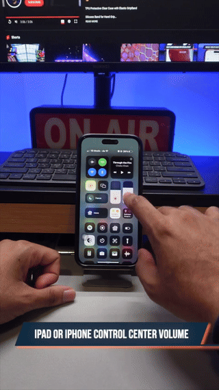
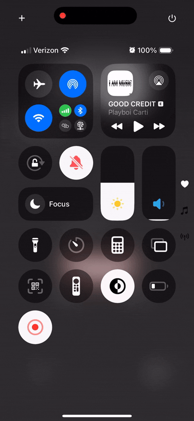

# The Slippery Song Sliders

Lawjay Lee

May 13, 2025

I use my iPhone every day. Some of the most common motions I perform
when using it are tap, hold, and slide gestures. The “tap” motion
involves placing your finger on a certain part of the screen.
“Holding” consists of maintaining contact between your finger and the
screen. Finally, “sliding” involves moving your finger in a specific
direction–such as up or down–while maintaining the contact between
your finger and the screen. I commonly perform this series of actions
when changing my phone volume through the touchscreen interface. I tap
on the volume slider, hold, and drag up on the screen to increase the
volume.

Recently, I upgraded my iPhone to a newer model after staying on an
older version for many years. However, when I began testing out my new
phone, I immediately noticed something different about this dragging
and sliding motion.

At the time, I was listening to music on my phone, and I felt that the
volume was too quiet. As such, I opened up my control center and began
the tap-and-drag motion I have become accustomed to on the volume
slider. I tapped, held, swiped up, and then released. However, I
immediately realized that the volume increased significantly more than
I expected. Confused, I investigated by playing with the slider
further and discovered that Apple recently changed how their sliders
work.

This interaction with the new phone challenged my mental model of how
I expected the slider to move. In usability engineering, a mental
model describes how people expect things to work based on their past
experiences. In my mental model, I expected the slider to stop moving
after I removed my finger from the screen. I came to this conclusion
after using my old iPhone for many years and learning that the iPhone
behaves this way. However, with my new phone, I noticed that the
slider continued to slide with some momentum even after I released my
finger. Upon learning about this change, I realized that
Apple’s conceptual model differed from my mental model. A conceptual
model describes how a designer expects their system to work. In this
case, Apple decided to make the sliders momentum-based, while I still
expected them to immediately stop moving after releasing my finger.

The concept of mapping describes the relationship between controls and
their outcomes. In my volume example, there is a mapping of sliding
your finger up on the screen to increase the volume.
Furthermore, natural mapping represents a mapping that closely mirrors
concepts that occur normally in nature. Upon further retrospection, I
concluded that while I may not yet be comfortable with the new system
for the sliders, the newer implementation provides a strong example
of natural mapping.

Momentum is something that constantly occurs in nature. When we grab a
ball, wind up our arm, and release it from our grasp, it continues to
fly in the direction we threw it. Because of this, it does make sense
to make the sliders continue to travel when we let go of them with
some velocity.

Designing input controls like volume sliders with natural mapping in
mind is beneficial for usability because it increases the chance that
users’ past experiences and mental models align well with how
designers intend their products to be used. Although I am initially
uncomfortable with the new change to the system, I understand that
this change may be more beneficial to many people in the future.
